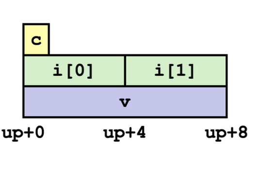

# Lecture Note 221 - L15

## Structures

### Linked List Example {1.1}

Since the compiler only understands the size and index we determine it using the memory pointer method {?}  
The method we will be using to determine the information is to point to the $Contiguous Memory$ 

 

`Structure` - Block of Memory  &rarr; Computes with Equation `r + 4*i` 

 
 

### Unalignment of Structure {1.2}

This is to determine the size of the $Contiguous Memory$ 

`Addition` is the way to go  

This chart below indicates the size of different types of data

| Data Type      | Size (in bytes) on a 64-bit System |
| -------------- | ---------------------------------- |
| char           | 1                                  |
| unsigned char  | 1                                  |
| int8_t         | 1                                  |
| short          | 2                                  |
| unsigned short | 2                                  |
| int16_t        | 2                                  |
| int            | 4                                  |
| unsigned int   | 4                                  |
| int32_t        | 4                                  |
| long           | 8                                  |
| unsigned long  | 8                                  |
| int64_t        | 8                                  |
| float          | 4                                  |
| double         | 8                                  |
| long double    | 16                                 |
| pointers       | 8 (on most 64-bit systems)         |

 
 

### Alignment of Structure {1.3}

The Alignment fills $Gaps$ 
The Alignment Takes the Largest Type of Bytes(K) And points using the $K*$ 

 
 

This shows how it stores each line in the struct 
An array of the struct is struct followed by an array with index &rarr; 

# Question
- [ ] At Linked List 1.1. What does pdf mean with the entire program? Understand the program.
- [ ] 

meaning if int = 4 then => then it should start or land on at the mutiple of 4 meaning 4k

so there is initutive way and there is alignment way [noalign][align]

for alignment find the largest of alignment byte = K and have to be mutiple of K

insert gaps if needed

alignment is more effcient

each part of the struct is the K\* of the largest

with alignment you can't count you have to follow the equation and use the formula to find otherwise you will get lost
above is the struct and we have union = strucut have different element but all can have different tyeps

union only store same data types in each section

union doesn't have gaps ; structs have gaps

floating Point registers
floating point has 256 bits meaning 32 bytes and 128 as part of it
different precsion takes into the place
is how the add together to become the 256 bits
and their arguments gets passed and results get return
