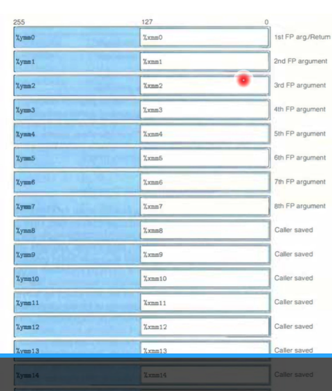

# Lecture Note 221 - L15

## Structures

### Linked List Example {1.1}

Since the compiler only understands the size and index we determine it using the memory pointer method {?}  
The method we will be using to determine the information is to point to the $Contiguous Memory$ 

 

`Structure` - Block of Memory  &rarr; Computes with Equation `r + 4*i` 

 
 

### Unalignment of Structure {1.2}

This is to determine the size of the $Contiguous Memory$ 

`Addition` is the way to go  

This chart below indicates the size of different types of data

| Data Type      | Size (in bytes) on a 64-bit System |
| -------------- | ---------------------------------- |
| char           | 1                                  |
| unsigned char  | 1                                  |
| int8_t         | 1                                  |
| short          | 2                                  |
| unsigned short | 2                                  |
| int16_t        | 2                                  |
| int            | 4                                  |
| unsigned int   | 4                                  |
| int32_t        | 4                                  |
| long           | 8                                  |
| unsigned long  | 8                                  |
| int64_t        | 8                                  |
| float          | 4                                  |
| double         | 8                                  |
| long double    | 16                                 |
| pointers       | 8 (on most 64-bit systems)         |

 
 

### Alignment of Structure {1.3}

The Alignment fills $Gaps$ 
The Alignment Takes the Largest Type of Bytes(K) And points using the $K*$ 

 
 

This shows how it stores each line in the struct 
An array of the struct is struct followed by an array with index &rarr; r + K*i` 

Saving Space by putting large data types first

 
  

## Unions

Unions don't have to fill the largest type of memory.  
They still use the largest memory to define `final size`  
But they don't fill gaps easily. They use as much space as they can.  
  

## Floating Point

They are 16 bytes = 256 bits  
`Single Precision` = 4 bytes = uses %mm1 and %mm0 as input to generate %mm0  
`Double Precision` = 8 bytes = uses %mm1 and %mm0 as input to generate %mm0  

floating point has 256 bits meaning 32 bytes and 128 as part of it
